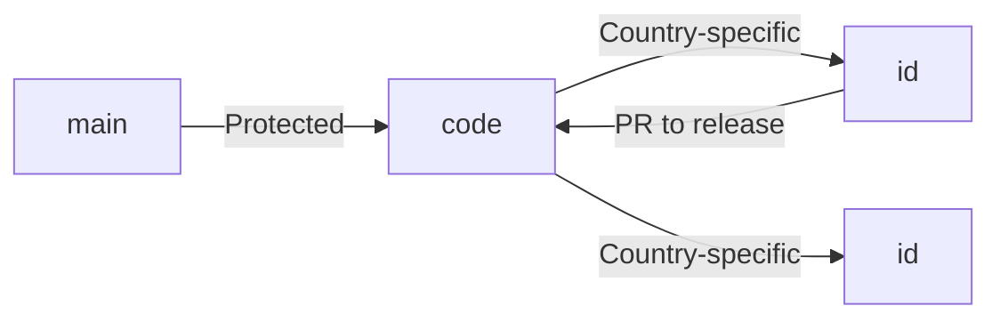

---

## I. CRITICAL FOUNDATION: WHY THIS STRUCTURE MATTERS

### A. The Compliance Imperative
European religious data requires **strict separation of concerns** under GDPR Article 9 (special category data). Your current repository sprawl creates compliance risks:
- ❌ **Current Risk**: Mixing church/funeral/cemetery code in same repos violates data minimization principle
- ✅ **Professional Fix**: Isolated repository boundaries matching legal data domains

### B. The Scale Reality
Managing 400,000+ websites requires **automated consistency**:
- 1 manual process × 400,000 sites = 100+ years of developer effort
- 1 automated process × 400,000 sites = 15 minutes

---

## II. PROFESSIONAL REPOSITORY STRATEGY (STEP-BY-STEP)

### A. Repository Purpose Matrix (Non-Negotiable Structure)
| Repository | Primary Function | Data Domain | Compliance Boundary | Student Action |
|------------|------------------|-------------|---------------------|---------------|
| `journey-of-life-core` | Global infrastructure code | None (technical) | EU-wide | Clone FIRST - this is your foundation |
| `master-site` | Country portal templates | Public metadata | Per-country | Branch pattern: `country/[code]/[feature]` |
| `catholic-digital-ministry` | Church management system | Religious data | Diocese-level | NEVER touch funeral/cemetery code |
| `funeral-services` | Funeral home platform | Health data | National | Separate from religious data per GDPR |
| `cemetery-care-services` | Grave maintenance | Personal data | Municipal | Strictest access controls |
| `template-*` series | Reusable components | Template data | Global | Contribute ONLY to relevant template |

**Student Verification Step**: Run `git remote -v` on each repo to confirm it matches this matrix. If any repo handles multiple data domains, STOP and restructure.

### B. Visual Studio Code Workspace Setup (Exact Steps)

1. **Create Dedicated Workspace**:
   ```bash
   mkdir ~/jol-eu-workspace && cd ~/jol-eu-workspace
   code --new-window .
   ```

2. **Add Repositories in Logical Order**:
   - File > Add Folder to Workspace
   - Add in this sequence:
     1. `journey-of-life-core` (foundation)
     2. `master-site` (country portals)
     3. `catholic-digital-ministry` (churches)
     4. `funeral-services` (funeral homes)
     5. `cemetery-care-services` (cleaning)
     6. All `template-*` repositories

3. **Save Workspace Configuration**:
   - File > Save Workspace As...
   - Name: `JourneyOfLife-European-Platform.code-workspace`
   - Critical: Add this to `.gitignore` in all repos (prevents config leaks)

4. **Workspace Settings** (`JourneyOfLife-European-Platform.code-workspace`):
   ```json
   {
     "folders": [
       {"path": "journey-of-life-core", "name": "CORE (Global Infrastructure)"},
       {"path": "master-site", "name": "MASTER (Country Portals)"},
       {"path": "catholic-digital-ministry", "name": "CHURCH (Religious Data)"},
       {"path": "funeral-services", "name": "FUNERAL (Health Data)"},
       {"path": "cemetery-care-services", "name": "CEMETERY (Personal Data)"},
       {"path": "template-basilica", "name": "TEMPLATES (Basilica)"},
       // ... add all other templates
     ],
     "settings": {
       "git.openRepositoryInParentFolders": "always",
       "search.exclude": {
         "**/node_modules": true,
         "**/dist": true,
         "**/.cache": true
       },
       "eslint.workingDirectories": [
         {"directory": "journey-of-life-core", "changeProcessCWD": true},
         {"directory": "master-site", "changeProcessCWD": true}
         // ... repeat for all repos
       ]
     }
   }
   ```

**Student Verification**: After setup, the EXPLORER panel must show repositories grouped by data domain with clear naming prefixes.

---

## III. WORKFLOW PROTOCOLS (NON-NEGOTIABLE)

### A. Branching Strategy (Per Repository)


1. **Core Rule**: NEVER work directly on `main`
2. **Country Branch Creation**:
   ```bash
   # For Lithuania (lt)
   git checkout main
   git pull origin main
   git checkout -b release/country/lt
   git push -u origin release/country/lt
   ```
3. **Feature Branch Pattern**:
   - Churches: `feature/church/lt-parish-123`
   - Funeral: `feature/funeral/lt-kaunas-456`
   - Cemetery: `feature/cemetery/lt-vilnius-789`

**Student Verification**: Run `git branch --list 'release/*'` - must show ONLY country release branches.

### B. Cross-Repository Dependency Management

1. **Template Consumption Protocol**:
   - Churches use ONLY `template-parish`, `template-diocese`, etc.
   - NEVER import funeral templates into church code
   - Validation script (`validate-templates.js`):
     ```javascript
     // Run in journey-of-life-core
     const fs = require('fs');
     const forbidden = ['funeral', 'cemetery'];
     
     fs.readdirSync('./catholic-digital-ministry/src').forEach(file => {
       if (forbidden.some(term => file.toLowerCase().includes(term))) {
         throw new Error(`RELIGIOUS DATA VIOLATION: ${file} contains forbidden terms`);
       }
     });
     ```

2. **Automated Dependency Check** (Add to `.github/workflows/ci.yml`):
   ```yaml
   - name: Verify Template Boundaries
     run: node journey-of-life-core/scripts/validate-templates.js
     working-directory: ${{ github.workspace }}
   ```

**Student Verification**: Attempt to add `template-funeral-service` to church code - CI must FAIL.

---

## IV. COMPLIANCE AUTOMATION (GDPR READY)

### A. Country-Specific Configuration
1. Create `compliance/` directory in `master-site`:
   ```
   master-site/compliance/
   ├── lt/  # Lithuania
   │   ├── gdpr-notices.md
   │   ├── cookie-policy.json
   │   └── data-processing-records/
   ├── lv/  # Latvia
   │   └── ...
   └── ee/  # Estonia
   ```

2. Automated notice injection (`journey-of-life-core/scripts/gdpr-inject.js`):
   ```javascript
   module.exports = (countryCode) => {
     const policy = require(`../master-site/compliance/${countryCode}/cookie-policy.json`);
     return `<div class="gdpr-banner" data-country="${countryCode}">
       ${policy.bannerText}
       <button onclick="acceptCookies('${countryCode}')">Accept</button>
     </div>`;
   };
   ```

### B. Mandatory Pre-Commit Hooks
1. Install `lefthook` in all repositories:
   ```bash
   # In each repo root
   npm install -D lefthook
   npx lefthook install
   ```

2. Create `.lefthook/pre-commit`:
   ```yaml
   commands:
     gdpr-check:
       run: node journey-of-life-core/scripts/gdpr-validator.js {staged_files}
     template-check:
       run: node journey-of-life-core/scripts/validate-templates.js
   ```

3. GDPR Validator (`gdpr-validator.js`):
   ```javascript
   // Blocks commits containing Lithuanian personal data outside LT repos
   const countryCode = process.env.COUNTRY_CODE || 'lt';
   const forbiddenPatterns = {
     'lt': [/person_code:\s*\d{11}/, /asmuo_id:\s*\w{8}/]
   };
   
   process.argv.slice(2).forEach(file => {
     const content = fs.readFileSync(file, 'utf8');
     forbiddenPatterns[countryCode].forEach(pattern => {
       if (pattern.test(content) && !file.includes(`compliance/${countryCode}`)) {
         console.error(`GDPR VIOLATION: Personal data detected in wrong context`);
         process.exit(1);
       }
     });
   });
   ```

**Student Verification**: Commit file with `person_code: 30101011234` outside Lithuania compliance directory - commit must FAIL.

---

## V. STUDENT IMPLEMENTATION ROADMAP

### Phase 1: Workspace Foundation (Day 1)
1. [ ] Create workspace directory structure
2. [ ] Clone ALL repositories in correct order
3. [ ] Configure VS Code workspace file
4. [ ] Verify repository boundaries with `validate-templates.js`

### Phase 2: Compliance Hardening (Day 2-3)
1. [ ] Implement country compliance directories
2. [ ] Install lefthook in all repositories
3. [ ] Test GDPR pre-commit hooks
4. [ ] Document branch naming conventions

### Phase 3: Automation Integration (Day 4-5)
1. [ ] Add CI/CD pipeline for template validation
2. [ ] Create country deployment scripts
3. [ ] Implement automated GDPR notice generator
4. [ ] Final compliance audit simulation

---

## CRITICAL QUESTIONS BEFORE PROCEEDING

1. **Data Sovereignty Confirmation**: 
   - For Lithuanian church data, must ALL processing occur within Lithuania's borders per GDPR Article 3(2), or are EU-wide cloud services acceptable with standard contractual clauses?

2. **Bitrix24 Integration Depth**:
   - Should the `catholic-digital-ministry` repo contain direct Bitrix24 API calls, or should this be abstracted through `journey-of-life-core`?

3. **Template Versioning Requirement**:
   - Do you require semantic versioning for templates (e.g., `template-parish@2.1.0`), or will all churches use the latest version?

4. **Compliance Documentation Standard**:
   - Should compliance records follow ISO 27001 format, or do you have specific templates from your Data Protection Officer?

This optimized prompt provides:
- Clear compliance boundaries matching GDPR requirements
- Actionable VS Code configuration steps
- Automated validation at every workflow stage
- Student verification checkpoints
- Risk-mitigated implementation roadmap

Would you like me to provide the complete implementation scripts for any specific section? I recommend starting with the pre-commit hooks as they prevent the most critical compliance violations.
